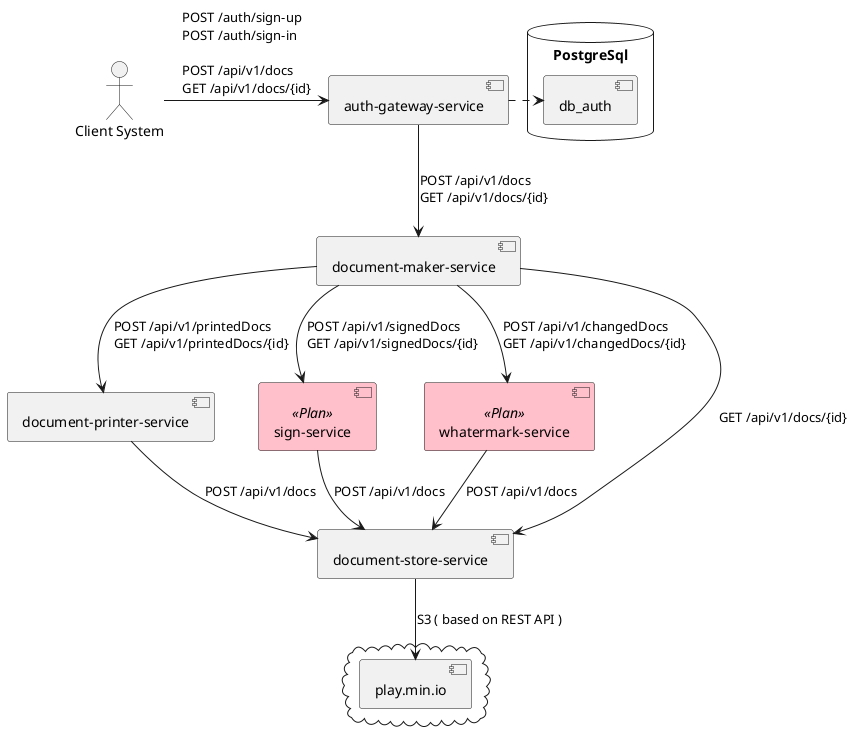

# Document Maker Service
- Сервис генерации печатных форма в формате PDF и сохранения в файловое хранилище.

## Используемые технологии
### Общие для всех сервисов
- Java 17
- Spring Boot
- Spring MVC
- OpenAPI
- Actuator
### Auth-gateway-service
- Spring Security
- Spring JPA
- Feign
- Resilience4J Circuit Breaker
### Document-maker-service
- Spring Integration
### Document-printer-service
- Thymeleaf
- Flying Saucer
- Feign
### Document-store-service
- Minio

## Используемые компоненты
### play.min.io (Cloud Service)
- система хранения файлов, поддерживающая протокол S3
### PostgreSQL
- база данных с открытым исходным кодом
### Docker и Docker Compose
- инструменты контейнеризации приложений

## Диаграмма компонентов

